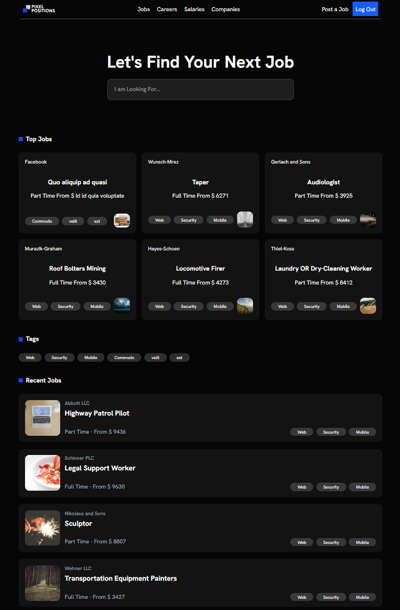

# <p style="text-align: center;">Pixels Positions</p>

**Pixels Positions** is the final project from the [30 Days to Learn Laravel](https://www.youtube.com/playlist?list=PL3VM-unCzF8hy47mt9-chowaHNjfkuEVz) course by **Laracasts** — one of the best course i have ever watched.
This project puts into practice all the concepts covered throughout the course, including:



- Models & Migrations
- Controllers
- Eloquent ORM
- Routing
- Blade Templating
- Authentication & Authorization (Gates & Policies)
- Middleware
- Queues
- Mailing
- Factories & Seeders

## Project Overview

**Pixels Positions** is a job board website that allows users to find and post job opportunities. It includes the following pages:

- **Home Page**
- **Login & Sign Up**
- **Add a Job**
- **Search for a Job**
- **Filter Jobs by Tag**

---

This project was a joyful and rewarding learning journey, offering hands-on experience with Laravel’s core features.

---

### To run the project on your device

```
npm install
composer install
cat .env.examples >> .env
php artisan key:generate
php artisan serve
npm run dev
```

don't forget to create the database, edit the .env and run the migrations and the seeders.
